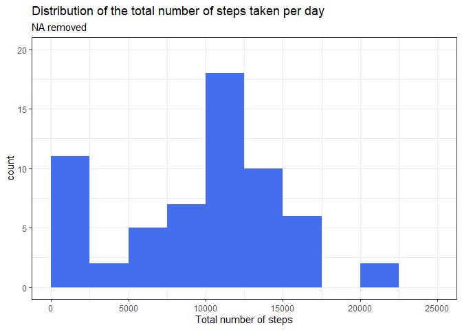
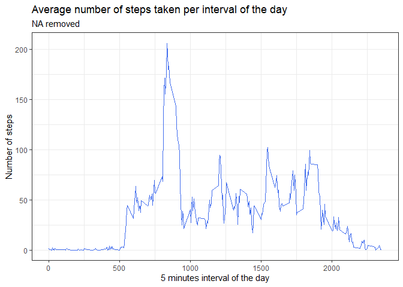
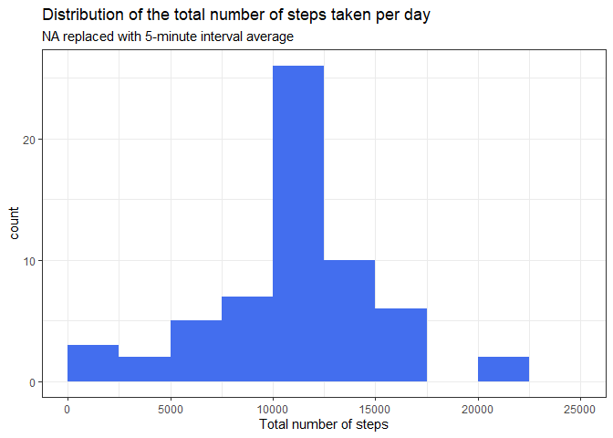
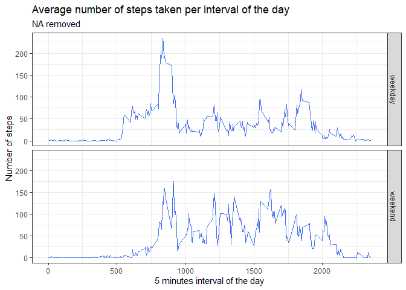

Before I start the analysis, I want to apologize for any writing problems that may have occurred, since English is not my native language. I hope you understand all the work and explanation in this file.

## Loading and preprocessing the data
The first part for this assignment is to read and load the data to be analysed. For this, the next code is used and the variable classes are ready to be used in the analysis.

```r
if (!file.exists("activity.csv")) {
  unzip("activity.zip", overwrite = T)
}
data <- read.csv("activity.csv", colClasses = c("numeric","Date","numeric"))
```

## What is mean total number of steps taken per day?
In order to obtain and analyze the data per day, the `dplyr` library is used. Also, all the plots are made with the `ggplot2` library. First, the data are grouped by date and the total number of steps are calculated:


```r
library(dplyr)
Steps <- data %>% group_by(date) %>% summarize(Total_Steps = sum(steps, na.rm = TRUE))
```

Then, the histogram of this data is made by using different properties in the plot.


```r
library(ggplot2)
Steps %>% ggplot(aes(Total_Steps)) + 
  geom_histogram(breaks=seq(from=0, to=25000, by=2500), fill = "royalblue2") +
  labs(title = "Distribution of the total number of steps taken per day",
       subtitle = "NA removed", x = "Total number of steps") +
  theme_bw() +
  ylim(c(0,20))
```



Finally, the mean and the median of the total step number are calculated by the commands:


```r
mean(Steps$Total_Steps)
median(Steps$Total_Steps)
```

Obtaining values of **9354.2295082** and **1.0395\times 10^{4}** respectively.

## What is the average daily activity pattern?
For this part, a similar analysis to the one made in the last point is performed. First, the data is grouped and organized by intervals of the day, and the mean value for each interval is calculated for all the analyzed period.


```r
intervals <- data %>% group_by(interval) %>% summarize(Average = mean(steps, na.rm = TRUE))
```

Then, using this data, a line plot is made to look at the average number of steps for each interval in the day.


```r
intervals %>% ggplot(aes(interval, Average)) + 
  geom_line(col = "royalblue2") +
  labs(title = "Average number of steps taken per interval of the day",
       subtitle = "NA removed",
       x = "5 minutes interval of the day",
       y = "Number of steps") +
  theme_bw()
```

<!-- -->

Finally, the five minute interval of the day with the maximum number of steps, on average, is found using the command:


```r
intervals$interval[which.max(intervals$Average)]
```
And the result obtained is **835**.

## Imputing missing values

Considering that there are some missing values in the dataset and that it may introduce bias into some calculations, the next step in the analysis is to try to correct this problems by modifying the dataset.  

* For this, the first step is to calculate the number of missing values in the dataset. That is made by using this command:  


```r
sum(is.na(data$steps))
```

Obtaining a total of **2304** missing values.  

* As there is a big total number of missing values, the next step is to modify the dataset changing each missing value by the mean value of steps of the corresponding five-minute interval of the day.  

To create this dataset, the next code is performed. Note that the quantity of missing values is calculated again, obtaining **0** values.  


```r
data1 <- data %>% mutate(steps = ifelse(is.na(steps), intervals$Average[match(interval, intervals$interval)], data$steps))
sum(is.na(data1$steps))
```

```
## [1] 0
```

* To compare this new dataset with the original one, a histogram of the first one is made. Also, the mean and the median values are calculated. The codes performed are similar to those in the first part and are shown below.


```r
new_steps <- data1 %>% group_by(date) %>% summarize(Total_Steps = sum(steps, na.rm = TRUE))
new_steps %>% ggplot(aes(Total_Steps)) + 
  geom_histogram(breaks=seq(from=0, to=25000, by=2500), fill = "royalblue2") +
  labs(title = "Distribution of the total number of steps taken per day",
       subtitle = "NA replaced with 5-minute interval average", x = "Total number of steps") +
  theme_bw()
```

<!-- -->


```r
mean(new_steps$Total_Steps)
median(new_steps$Total_Steps)
```

The new mean and median values in the dataset are 1.0766189\times 10^{4} and 1.0766189\times 10^{4} respectively.  

These values are bigger than the values in the original dataset. The bigger difference is in the mean value, that, interestingly, have the same value than the median for the new dataset. Using mean values instead of ignoring missing values made the dataset look more normal and it could be the reason for this behavior.

## Are there differences in activity patterns between weekdays and weekends?

For doing this analysis, the first step is to create a new factor in the dataset to indicate if the date if the sample in the dataset was recorded in weekdays or in weekends. The code performing this operation is the shown here:


```r
data2 <- data %>% mutate(daytype = 
                           ifelse(weekdays(data$date) == "sábado" | weekdays(data$date) == "domingo",
                                  "weekend", "weekday"))
```

Then, to compare the behavior of the two types of days, a panel plot of the 5-minute interval and the average number of steps taken is performed.  


```r
data2 %>% group_by(interval, daytype) %>% 
  summarize(daytype = as.factor(daytype), Average = mean(steps, na.rm = TRUE)) %>%
  ggplot(aes(interval, Average)) + 
  facet_grid(daytype ~ .) +
  geom_line(col = "royalblue2") +
  labs(title = "Average number of steps taken per interval of the day",
       subtitle = "NA removed",
       x = "5 minutes interval of the day",
       y = "Number of steps") +
  theme_bw()
```

<!-- -->

In this case, it is possible to see some differences even though the behavior is almost random. In the weekends, the mean value across all the day seems higher than the mean value in the weekdays. Also, in the weekdays the activity seems to start earlier in the morning and to finish earlier in the afternoon/evening.

